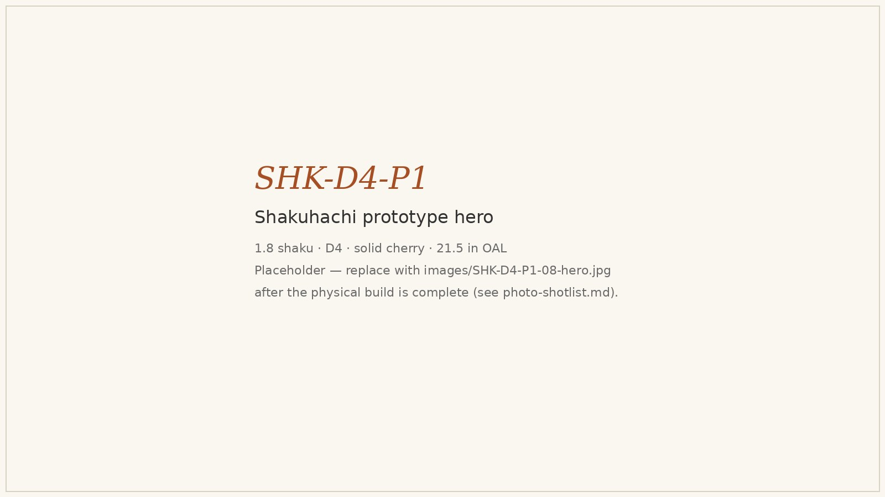

# Shakuhachi — Engineering Documentation for the Japanese End-Blown Bamboo Flute

> *A solid-billet hardwood adaptation of the shakuhachi, with parametric design for an 11-key family and a build-packet for the first prototype: 1.8-shaku D4 in cherry, bored using the headstock-driven deep-bore drilling technique on the lathe.*


*Placeholder hero plate: SHK-D4-P1, solid cherry, 21.5 in OAL, tuned to D4. Replace this file with the canonical 35° oblique product shot after the physical build is complete — see [photo-shotlist.md](photo-shotlist.md) shot 08.*

## Release status

**Status: L2 V5 build-packet candidate.** The packet set is in place: README rewrite, design docs, BOM/sourcing/cut list/validation, assembly manual, risks, Wolfram starter, drawings, OpenSCAD reference, print/deck artifacts, and the public build-log site all exist. V5 artifacts (`visual-output-register.csv`, `cad/mcp-session-log.md`, `family-spec.csv`) added 2026-05-29.

The remaining blockers are explicit:

- **No measured prototype data yet.** `validation.csv` is a build-and-measure plan, not a filled results log.
- **Hero media is still provisional.** The current hero is a placeholder plate until SHK-D4-P1 is physically built and photographed.
- **OpenSCAD source is pending measurement confirmation.** `cad/shakuhachi_master.scad` is the current geometry source; dimensions are first-order estimates — not fabrication authority until prototype bore/utaguchi correction loop closes.

**Next action:** build SHK-D4-P1, ingest the first measured Ro fundamental with `record_measurement.py`, then either export a confirmed drawing/render set from CAD or keep the repo explicitly framed as an OpenSCAD-first prototype packet.

## What this is

Engineering documentation and parametric design for the **shakuhachi** (尺八) — a Japanese end-blown bamboo flute traditionally tuned in a minor pentatonic with five finger holes. This repository combines:

1. **A parametric design table** ([`shakuhachi-design-table.xlsx`](shakuhachi-design-table.xlsx)) covering an 11-key family (C4 through higher), with formulas that derive every build dimension from the target fundamental, plus a Wolfram-Cloud notebook spec for honkyoku phrase synthesis and meri / kari pitch-shift modeling.
2. **A build packet for SHK-D4-P1** — the first physical prototype, 1.8-shaku D4 in solid cherry. See [`design.md`](design.md) for the governing acoustic model, [`bom.csv`](bom.csv), [`cut-list.csv`](cut-list.csv), [`validation.csv`](validation.csv), and [`assembly-manual.md`](assembly-manual.md). Drawings live in [`drawings/`](drawings/), CAD masters in [`cad/`](cad/), and the public build log in [`site/index.html`](site/index.html).
3. **A practical bore-making path** tied to the still-open [headstock-driven deep-bore drilling](https://github.com/tonykoop/instrument-maker/issues/84) technique on the [`instrument-maker`](https://github.com/tonykoop/instrument-maker) backlog. The 21.5-in cherry bore is what made this technique necessary — the shakuhachi is a perfect fit for it.

Sister projects: [`flutes`](https://github.com/tonykoop/flutes) (NAF — K2 reference, not portable here), [`fujara`](https://github.com/tonykoop/fujara) (long open-pipe stave-built sister), [`transverse-flute`](https://github.com/tonykoop/transverse-flute) (slip-cast open-pipe; packet template baseline).

## Cultural attribution

The shakuhachi descends from Tang-Chinese xiao ancestors imported to Japan in the 7th–8th c., and was central to the practice of *suizen* ("blowing meditation") within the Fuke sect of Zen Buddhism (Edo-period komusō, "emptiness monks"). The Meiji government banned the Fuke sect in 1871; the instrument survived in concert and ensemble use, and modern **Kinko-ryū** and **Tozan-ryū** schools continue traditional practice. Traditional makers in Kyoto, Tokyo, and Hamamatsu still build with **madake bamboo** (*Phyllostachys bambusoides*), urushi-lined bores, and water-buffalo-horn utaguchi inlays. The instruments documented here are **Western luthier-shop adaptations** built in respect for that tradition — not faithful reproductions. Where this packet diverges from tradition (solid hardwood billet, straight bore, oil finish, no urushi) it is documented as such.

## Background — what makes a shakuhachi different

**1. Voicing comes from the utaguchi cut, not a fipple.** The shakuhachi has no fipple block, no slow-air chamber, no whistle-type window. It is a direct end-blown flute: the player rests the lower lip against the utaguchi (a beveled notch cut into the rim) and directs a focused jet of air across its outer edge. This makes the instrument acoustically simple but technically demanding — every note relies on the player's lip and breath shaping.

**2. Five tone holes and a deep modal language.** Four front holes plus one thumb hole on the back, tuned to the Kinko-ryū interval set (+0/+3/+5/+7/+10/+12 semitones above the fundamental). The minor-pentatonic shape gives the instrument its characteristic voice; microtonal pitch-bending via *meri* (chin-down) and *kari* (chin-up) extends each tonal centre by ~50–100 cents.

**3. Length is the key.** A shakuhachi tuned to D4 has the standard length of 1.8 shaku (~21.5 in / 54.5 cm) — the very name 尺八 means "1.8" (one shaku eight sun). Lower keys take longer instruments: 2.4 shaku ≈ A3, 1.6 shaku ≈ E4, etc. The packet covers an 11-key parametric family, but the build-packet first prototype anchors at the canonical 1.8-shaku D4.

## The parametric design table

The single engineering-heavy artifact is [`shakuhachi-design-table.xlsx`](shakuhachi-design-table.xlsx). Variables in column A; per-key columns flow right.

**User-set per key:** Bore ID, Wall Thickness, Utaguchi Width / Depth / Angle, Extra Length (allowance for foot trim during tuning).

**Calculated per key:**
- Acoustic length `L_acoustic = c / (2·f_fund)`
- End-correction total (foot ≈ 0.6·r, utaguchi ≈ 1.7·r empirical)
- Effective physical length `L_physical = L_acoustic − δ_total`
- Shaku-length conversion (1 shaku = 11.93 in)
- Hole positions for Ro / Tsu / Re / Chi / Ri / thumb at Kinko-ryū intervals

**Compared to the NAF design table:** the workbook does **not** apply the K2 bore-diameter correction. K2 was derived from fipple-block + slow-air-chamber NAFs; the shakuhachi has neither. K2 columns are intentionally blank for shakuhachi rows. See [`design.md` § Empirical-correction guard](design.md).

## Build packet — SHK-D4-P1

| Parameter         | Value                          | Notes                               |
| ----------------- | ------------------------------ | ----------------------------------- |
| Fundamental       | 293.665 Hz (D4)                | 1.8-shaku canonical                 |
| Physical length   | 21.50 in (54.61 cm)            | 1.80 shaku                          |
| Bore ID           | 0.787 in (20 mm)               | H7 reamed from 0.5/0.625/0.75 steps |
| OD                | 1.10 in                        | Wall ≥ 0.150 in everywhere           |
| Material          | cherry (qtr-sawn)              | backup: hard maple, walnut          |
| Tone holes        | 5 (4 front + thumb)            | Ø 0.276 in starting; file-tuned     |
| Utaguchi          | 0.787 W × 0.315 D × 32°        | hand-cut + filed                     |
| Bore-making path  | headstock-driven deep-bore     | [`instrument-maker#84`](https://github.com/tonykoop/instrument-maker/issues/84) |

**Why SHK-D4-P1 is the right first prototype**, in priority order:

1. **It's the canonical shakuhachi.** The 1.8-shaku D4 is the standard reference instrument in both Kinko-ryū and Tozan-ryū traditions. Anything else is a divergence; this one is the centre of gravity.
2. **It's the boundary condition for the family.** All other family members' physical lengths, bore IDs, and end corrections derive from the same model. SHK-D4-P1's measured fundamental refines δ_utaguchi for the rest.
3. **It exercises the deep-bore drilling technique cleanly.** 21.5 in × 0.787 in is the depth-to-diameter ratio that motivated the headstock-driven technique on the [instrument-maker backlog](https://github.com/tonykoop/instrument-maker/issues/84). Building it validates the technique alongside the instrument.
4. **It's structurally safe.** Wall thickness with the planned OD (1.10 in) is 0.157 in nominal — comfortable margin over the 0.150 in minimum even at the widest tone hole.
5. **It's empirically anchored.** Traditional 1.8 shaku ↔ D4 is well-attested across centuries of Japanese makers, so a wrong prediction is immediately and unambiguously wrong (vs. being absorbed into measurement noise on a less-canonical key).

Detail in [`design.md`](design.md), [`assembly-manual.md`](assembly-manual.md), and [`risks.md`](risks.md). The validation plan with measurement-driven empirical loop is in [`validation.csv`](validation.csv).

## Repository structure

```
shakuhachi/
├── shakuhachi-design-table.xlsx   parametric workbook (11-key family)
├── design.md                      governing model + first-prototype design
├── bom.csv                        bill of materials, 16 line items
├── sourcing.csv                   suppliers + SKUs
├── cut-list.csv                   blank → finished part operations
├── validation.csv                 measurement-driven test plan
├── assembly-manual.md             13-step shop manual
├── supplier-rfq.md                RFQ template for outside vendors
├── drawing-brief.md               drawing list, datums, tolerances
├── visual-bom-brief.md            single-sheet BOM plate spec
├── photo-shotlist.md              hero + process + detail shots
├── risks.md                       red-team risk register w/ tests
├── wolfram-starter.wl             Wolfram parametric model
├── cad/                           OpenSCAD master + readme
├── cnc/                           pipeline scope notes (out-of-scope for body)
├── drawings/                      6 SVGs (overall, bore section, utaguchi,
│                                  hole template, vise fixture, hole jig)
├── images/                        photos (populated during build)
└── site/index.html                public build-log page
```

## Status

- **Repo:** packet generated, close-ready for human release review.
- **First prototype (SHK-D4-P1):** dimensions specified, validation plan written, risk register filed; **no physical build yet**.
- **Family roll-out:** queued; reads forward from the empirical correction the first measurement produces.

## How to read this repo

If you're a maker / reviewer evaluating the engineering: start with [`design.md`](design.md) § Governing Model, then [`risks.md`](risks.md), then [`assembly-manual.md`](assembly-manual.md). The CSVs are the ground truth for shop work; the SVGs in [`drawings/`](drawings/) are the manufacturing references.

If you're an outside builder: the [`site/index.html`](site/index.html) public build log is the friendly front door.

## License

Code, drawings, and design documentation: [CC BY 4.0](LICENSE).
