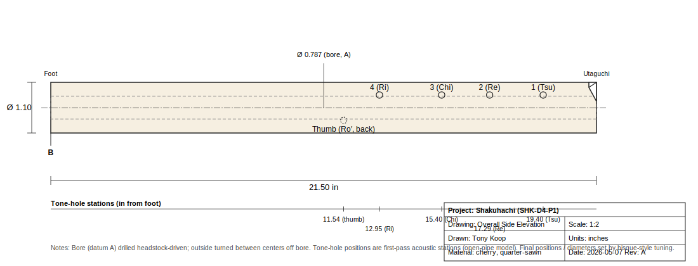
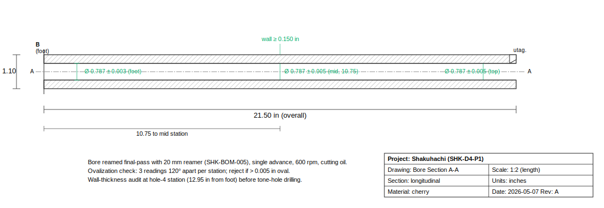
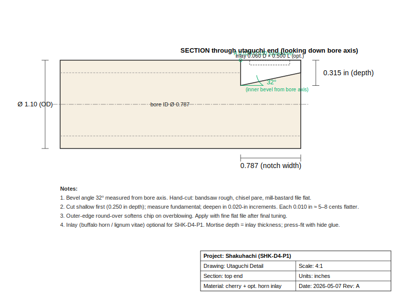
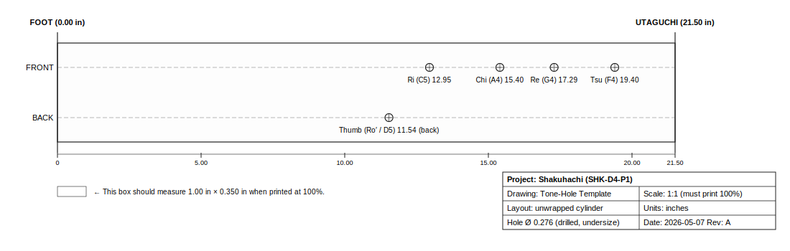
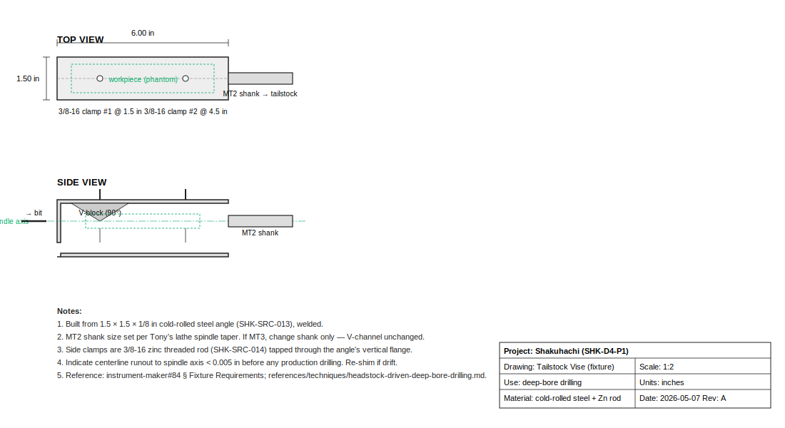
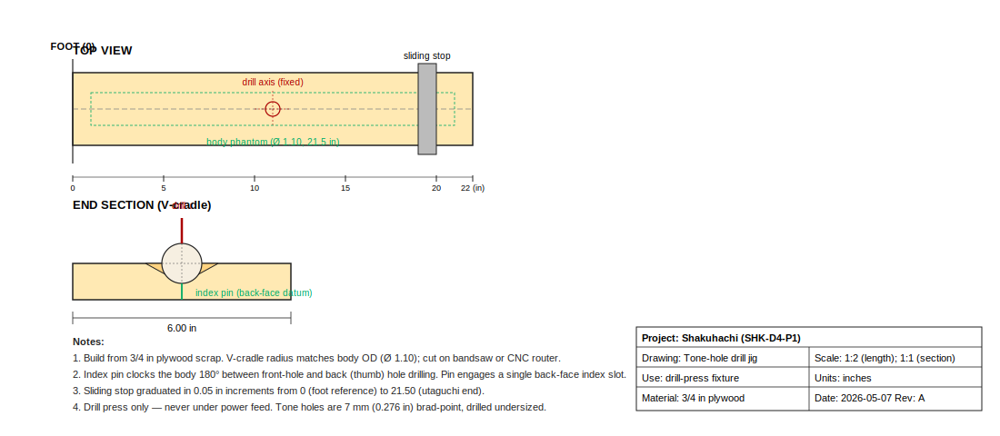

# Shakuhachi Capstone — SHK-D4-P1

# Title
## Shakuhachi (SHK-D4-P1)
1.8-shaku D4, solid cherry, headstock-driven deep-bore drilling

Tony Koop · 2026-05-07

# Project Intent
Build a small, manufacturable family of solid-billet hardwood shakuhachi (1.8 shaku D4 first; sized siblings later) on a Western luthier's lathe + drill press, with the long bore drilled using the headstock-driven deep-bore drilling technique on square stock before the outside is turned round. Document the open-pipe acoustic model honestly — explicit foot vs utaguchi end corrections — so the first prototype's measured pitch drives a corrections database update rather than a hand-tuned one-off. This packet is a Western adaptation, not a tradition-faithful reproduction.

# Cultural Framing
Shakuhachi (尺八) descends from Tang-Chinese xiao ancestors imported to Japan in the 7th–8th c.; central to suizen ("blowing meditation") in the Fuke sect of Zen Buddhism. Banned by Meiji 1871; survives in concert use through Kinko-ryū and Tozan-ryū schools today. Traditional makers in Japan still use madake bamboo with urushi-lined bores — this packet documents a respectful Western solid-billet adaptation, not a reproduction.

# Physics Model

```
f = c / (2 · L_eff)
L_eff = L_physical + δ_foot + δ_utaguchi
δ_foot ≈ 0.6 · r_bore                    (standard open-end correction)
δ_utaguchi ≈ 1.5–2.0 · r_bore             (empirical shakuhachi extension)
hole_distance_from_foot ≈ L_acoustic · (f_fund / f_hole)
```

Open-open pipe with two open ends. Foot is a normal flange-like end. Utaguchi is harder: bevel + jet excitation extend the acoustic open-point past the rim. Back-fitting from canonical 1.8-shaku ↔ D4 gives ~1.7·r per end empirically.

**Empirical-correction guard:** Tony's NAF K2 corrections do NOT apply — shakuhachi has no fipple, no SAC. K2 columns deliberately blank.

# Hardware Alignment
- **Pipeline:** lathe + drill press + hand-finished utaguchi
- **Bore strategy:** headstock-driven deep-bore drilling on square stock — see [`instrument-maker#84`](https://github.com/tonykoop/instrument-maker/issues/84)
- **Outside turn:** between centers off bore (pin-centers register the bore axis as the lathe axis)
- **Tone holes:** drill press w/ V-cradle jig; undersize 7 mm starts, file-open during tuning
- **Utaguchi:** bandsaw rough → chisel pare to 32° bevel → mill-bastard file flat → 0.020 in round-over
- **Finish:** walnut oil bore + outside, 3–5 day cure; carnauba wax outside only

# First Prototype — SHK-D4-P1

| Parameter         | Value                          |
| ----------------- | ------------------------------ |
| Fundamental       | 293.665 Hz (D4)                |
| Physical length   | 21.50 in / 54.61 cm / 1.80 shaku |
| Bore ID           | 0.787 in (20 mm)               |
| OD                | 1.10 in                        |
| Material          | cherry, quarter-sawn           |
| Wall (nominal)    | 0.157 in                       |
| Tone holes        | 5 (4 front + thumb)            |
| Initial hole Ø    | 0.276 in (7 mm)                |

# Family Targets — 11-key parametric

| ID         | Key  | Fund (Hz) | L_phys (in) | Bore ID | Status |
| ---------- | ---- | --------: | ----------: | ------: | ------ |
| SHK-C4-001 | C4   |   261.626 |       24.26 |   0.787 | family — defer |
| SHK-D4-001 | D4   |   293.665 |       21.53 |   0.787 | **first prototype** |
| SHK-Eb4-001| Eb4  |   311.127 |       20.28 |   0.787 | queued |
| SHK-E4-001 | E4   |   329.628 |       19.10 |   0.787 | queued |
| SHK-F4-001 | F4   |   349.228 |       18.10 |   0.669 | queued |
| SHK-G4-001 | G4   |   391.995 |       16.08 |   0.669 | queued |
| SHK-A4-001 | A4   |   440.000 |       14.30 |   0.591 | queued |
| SHK-B4-001 | B4   |   493.883 |       12.72 |   0.591 | queued |

# Tone-hole Stations (SHK-D4-P1, Kinko-ryū)

| Hole          | Note  | Δ semi | f_hole (Hz) | d_foot (in) | Face  |
| ------------- | ----- | -----: | ----------: | ----------: | ----- |
| Hole 1 (Tsu)  | F4    |     +3 |     349.228 |       19.40 | front |
| Hole 2 (Re)   | G4    |     +5 |     391.995 |       17.29 | front |
| Hole 3 (Chi)  | A4    |     +7 |     440.000 |       15.40 | front |
| Hole 4 (Ri)   | C5    |    +10 |     523.251 |       12.95 | front |
| Thumb (Ro′)   | D5    |    +12 |     587.330 |       11.54 | back  |

Holes are first-pass acoustic stations; bisque-style filing brings each to ±10 cents.

# Build Workflow
1. Mill 3 cherry blanks, 1×1×24 in qtr-sawn
2. Build tailstock vise (one-time fixture, MT2 shank)
3. Pine-scrap validation pass: bore wander < 0.020/0.040/0.080 in @ 6/12/18 in
4. Production deep-bore: 3/8 → 1/2 → 5/8 → 3/4 → 0.787 in reamer
5. Outside turn between centers off bore, OD 1.10 in
6. Tone-hole layout: 1:1 paper-wrap template, awl-punch, drill 7 mm undersize
7. Utaguchi cut: bandsaw → chisel → file → round-over
8. Bisque-style tuning: fundamental + each hole + octave
9. Walnut-oil cure 3–5 days; carnauba wax outside
10. Final-tuner pass; record_measurement.py → empirical loop

# Drawings








# BOM Highlights

16 line items in `bom.csv`. Total estimated cost ~430 USD (excluding optional inlay + mortising chisels). Long-lead item: 20 mm × 24 in straight-flute reamer (~10 days). Hardwood blanks ship in 5–7 days.

Categories: tonewood (3 blanks), deep-bore tooling (pilot + step-up + reamer + vise), drill-press jig, tone-hole tooling (brad-points + diamond files), validation hardware (tuner + bore gauge + thermometer), finish (walnut oil + carnauba), optional inlay (buffalo horn + chisels).

# Validation Plan

- Pine-scrap pass (mandatory before production cherry)
- Post-bore: 3-station bore-ID audit + ovalization < 0.005 in
- Post-turn: wall-thickness audit (≥ 0.150 in everywhere)
- Post-utaguchi: Ro fundamental ±25 cents pre-tuning
- Per-hole: ±10 cents post-tuning each
- Octave check: Ro → Ro′ within ±25 cents
- 30-day stability: < 5 cents drift at constant 68 °F

Each measurement = a row in `validation.csv` with environment columns mandatory.

# Risks (highest five)

1. **Utaguchi end-correction wrong** → fundamental ±15-40 cents off; refit δ_utaguchi before sibling cuts.
2. **Bore wander > spec on production cherry** → switch to staged drilling from both ends.
3. **Octave error > 25 cents** → bore taper or utaguchi geometry; reshape, don't tone-hole-tune.
4. **Wall too thin around hole 4** → reject blank if any quadrant < 0.140 in.
5. **NAF K2 corrections accidentally applied** → guarded in design.md and workbook; do not.

Full register in `risks.md` — every risk has a verification test attached.

# Empirical Loop

```bash
python3 ~/.claude/skills/instrument-maker-v4/scripts/record_measurement.py \
  --packet . \
  --note-id Ro \
  --measured-hz 293.6 \
  --tuner "Korg OT-120" \
  --environment "shop, 68F, 45% RH"
```

Updates `validation.csv`, computes cents error, refits per-family `δ_utaguchi`. Sibling packets (Eb4 / E4 / F4 / G4 / A4 / B4) read the corrected value before their blanks are cut.

# Open Assumptions

- δ_utaguchi ~1.7·r is empirical; first measurement re-fits.
- Bore is straight cylindrical (not tapered like madake).
- Hole diameters uniform 0.276 in starting size.
- Wood-species sensitivity unmeasured; cherry first.
- No urushi lining; oil-finish substitute.
- Player calibration absorbed into utaguchi correction.

# Next Actions

- Order BOM SHK-BOM-001 through 010 + 013–014 (cherry, deep-bore tooling, validation, finish).
- Build tailstock vise + tone-hole jig (one-time fixtures).
- Pine-scrap validation pass.
- Cut SHK-D4-P1 cherry blank; deep-bore; outside turn; layout + drill holes; utaguchi.
- Bisque-style tune; record measurement.
- Decide F4 / A4 sibling cut order based on δ_utaguchi refit.

Replace TBDs with measured/source-backed values.
